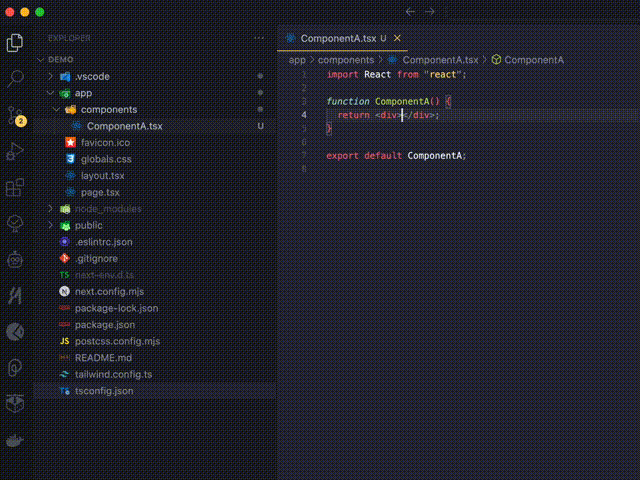

==> This extension was mostly generated using Claude so your mileage may vary. :) <==

# Lightbulb Create React Component

Lightbulb Create React Component is a Visual Studio Code extension that simplifies the process of creating new React components in your projects. It provides a quick and easy way to generate react component files and automatically add import statements via the lightbulb menu.

## Features

- Create new React component files with a single click or command
- Automatically add import statements for newly created components
- Supports TypeScript React (.tsx) files
- Provides a quick fix option in the lightbulb menu for undefined components
- Works in the context of your current file, creating components in the same directory

## Installation

1. Open Visual Studio Code
2. Go to the Extensions view (Ctrl+Shift+P or Cmd+Shift+P on macOS)
3. Search for "Lightbulb Create React Component"
4. Click Install

Alternatively, you can install the extension from the [Visual Studio Code Marketplace](https://marketplace.visualstudio.com/items?itemName=MaikEvers.lightbulb-create-react-component).

## Usage

### Using the Command Palette

1. Open a TypeScript React (.tsx) file
2. Open the Command Palette (Ctrl+Shift+P or Cmd+Shift+P on macOS)
3. Type "Create React Component" and select the command
4. Enter the name of your new component when prompted
5. The new component file will be created in the same directory as your current file, and an import statement will be added at the top of your current file

### Using the Quick Fix Option

1. In a TypeScript React (.tsx) file, type the name of an undefined component, e.g., `<NewComponent />`
2. Click on the component name
3. Click on the lightbulb icon that appears or use the quick fix keyboard shortcut (Alt+Enter or Option+Enter on macOS)
4. Select "Create new React component 'NewComponent'" from the menu
5. The new component file will be created, and an import statement will be added automatically

## Configuration

Currently, this extension does not require any additional configuration. It works out of the box with default settings.

## Contributing

Contributions are welcome! Please feel free to submit a Pull Request.

## License

This extension is licensed under the [MIT License](LICENSE).

## Support

If you encounter any problems or have any suggestions, please [open an issue](https://github.com/maikevers/lightbulb-create-react-component/issues) on our GitHub repository.

Enjoy creating React components with ease!
